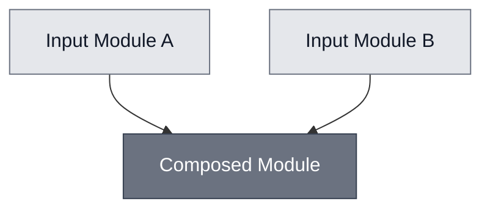
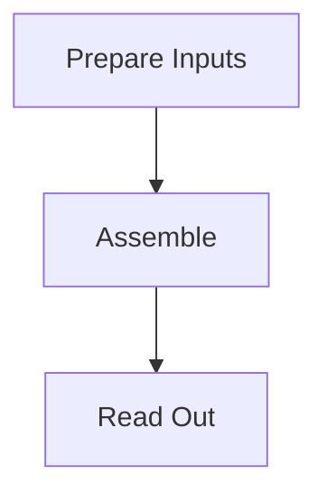
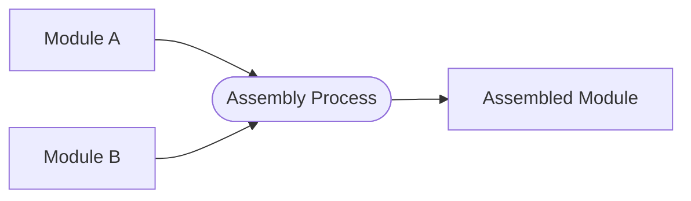
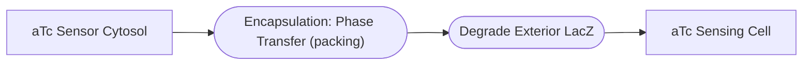
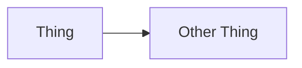
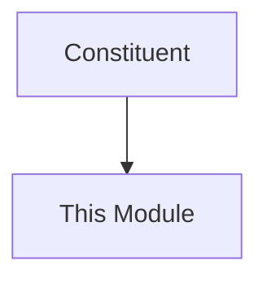

# Mermaid diagrams for Nucleus docs

Write the source. Do not render it.

Rendering (`.mmd` → PNG/SVG for slides) is a separate concern with separate
tooling and is deliberately out of scope here. Everything below produces text
that goes into a Markdown page.

## Two hard rules, both learned the painful way

### 1. Fence form depends on the renderer

| Fence | MyST site | Obsidian |
| --- | --- | --- |
| ` ```mermaid ` | renders | **renders** |
| ` ```{mermaid} ` | renders | **blank** |

Obsidian only understands the plain fence. MyST understands both. **Default to
the plain fence** — one form that works everywhere — unless the repo you are
editing has already standardised on the directive form, in which case match it
and say so.

Check before writing:

```bash
grep -rc '^```mermaid$'    docs/ --include='*.md' | awk -F: '{s+=$2} END {print "plain:     "s}'
grep -rc '^```{mermaid}'   docs/ --include='*.md' | awk -F: '{s+=$2} END {print "directive: "s}'
```

If a repo is split across both forms, raise it — mixed fences mean some diagrams
are invisible in one of the two tools, and nobody notices until someone opens the
wrong one.

### 2. Node ids must be identifier-safe, and must never come from prose

A Mermaid node id cannot contain spaces. Derive ids mechanically:

```python
def node_id(slug):
    return re.sub(r"[^A-Za-z0-9]", "_", slug).upper()
```

**Why this is a rule and not a preference.** A terminology sweep once replaced a
word across a docs tree. That word was a node id in two diagrams, and the
replacement contained a space:

```
    composed thing["A Composed Thing"]     <-- broken: id has a space
    INPUT --> composed thing               <-- broken: same
```

Both diagrams silently stopped rendering. So: ids are `UPPER_SNAKE`, labels are
prose inside quotes, and the two never share a string. After **any** text sweep
over a directory containing diagrams, check for the damage:

```bash
grep -rnE '^\s+[a-z]+ [a-z]+\[|--> [a-z]+ [a-z]+$|,[a-z]+ [a-z]+ ' docs/ --include='*.md'
```

## Greyscale unless colour is asked for

Default to greyscale. Colour should carry meaning, and most diagrams have no
meaningful distinction to encode — a diagram that is colourful for decoration
teaches the reader nothing and costs contrast.

```
    classDef leaf     fill:#e5e7eb,stroke:#6b7280,color:#111827;
    classDef composed fill:#6b7280,stroke:#374151,color:#ffffff;
```

Two shades is usually enough: lighter for inputs and leaves, darker for things
built out of other things.

**When the user does ask for colour**, use a colourblind-safe palette and use it
to encode one real distinction. See `references/palettes.md`.

## Three diagram types, and keep them separate

The single most common mistake is mixing kinds of thing in one diagram.

### Module dependency graph — modules only

What a module is composed of. Every node is a module; every edge is "is a
constituent of". No processes, no analytes, no equipment.



Arrows point **from constituent to container** — "this feeds into that."

### Process dependency graph — processes only

Which protocol has to happen before which. Every node is a process page.



### Combined implementation view — modules and processes together

Only here do the two mix, and they must be visually distinguishable. Modules are
**boxes**, processes are **stadiums** `([...])`:



Do not use diamonds for processes — a diamond reads as a decision point and will
mislead. Reserve diamonds for genuine branch points, such as an undecided design
choice.

**Put the operator on the process node**, in parentheses: `Assemble Cytosol
(mixing)`, `Encapsulation: Phase Transfer (packing)`. The operator is a property
of the process, not of any one edge — a step with four inputs is a hyperedge and
cannot carry the operator on an arrow.

**A step may run a chain of processes.** Draw each as its own stadium with an
arrow between them, and no Module node in between:



Do not merge them into one node. A node takes one click target, so merging
silently drops the link to the second page. The operator goes on whichever link
performs the composition; a link that composes nothing — a purification, say —
carries none, which is the honest reading rather than a borrowed one.

**A process with no page is marked in words**, `— no page` appended to the
label. Do not use a dashed border: dashed means *proposed* (see Status
conventions), and "nobody wrote the page" is not a claim about whether the step
works.

### Recursive depth — default 1

A composition graph can always be expanded further down. **Module pages render at
depth 1**; deeper renders are for review material, not for the site.

**Depth 1: anything you can obtain is a leaf.** Only what this module builds on
the way to its own result is expanded. Base Cytosol is a leaf, and so is S30
Lysate — each is a thing you can have, and its own page says how it is made.

**Having a page is not the test.** `aTc Sensor Cytosol` has a page and is still
expanded on the cascade that builds it, because that cascade builds it. The test
is *obtained* versus *built here*, and it needs a judgement per module. Get it
wrong and a cascade page either swallows its constituents' pages or says nothing.

**Depth 2 and deeper** follow each leaf's own composition source where one
exists, splicing it in at the node the parent already names. Use it for readiness
reviews and slides. A depth-3 cascade diagram is unreadable on a docs page.

## Status conventions

Three edge styles, three genuinely different claims. Do not collapse them.

| Style | Meaning |
| --- | --- |
| `A --> B` | confirmed — this has been demonstrated |
| `A -.-> B` | proposed — believed to work, not yet attempted |
| `A --x B` | blocked — the parts work, this specific integration does not |

`-.->` and `--x` are not synonyms. "Nobody has tried it" and "we tried and it is
prevented" are different states, and conflating them loses the only information
a reader wanted.

**Node borders.** A node gets a dashed border if **any** incoming edge is
dashed. Propagate downstream from edge targets:

```
    style DOWNSTREAM_NODE stroke-dasharray: 5 5
```

**Evidence proportional to claim.** `--x` asserts that something does not work.
That is the strongest claim available and needs the strongest evidence. Before
drawing one, confirm there is a documented result behind it, not an inference. A
`--x` supported only by a verbal report should be `-.->` with the concern in
prose.

**Legends are standalone.** Render a legend as its own small diagram, never as a
subgraph inside the main one — a subgraph wrapper adds a background tint and
visually implies grouping that is not there.

## Derive the diagram from the page, do not hand-maintain it

A hand-drawn dependency diagram drifts from the pages within weeks. If the
composition is already written in the docs, generate the diagram from it.

**Prefer a `composition.yml` beside the spec where one exists.** The bullet list
below carries no order, no operator, no process and no compartment, so a diagram
derived from it can only show *what* composes and never *how* (issue #248). A
module with a composition source should be rendered from it — in `nucleus-docs`,
by `scripts/render-composition.py`. Harmonising the two generators is issue #250.

Where there is no source yet, most Nucleus module pages carry a
`# Constituent Modules` section, which is a machine-readable dependency graph:

```python
m = re.search(r"^#+\s*Constituent Modules\s*$(.*?)(?=^#|\Z)", text, re.M | re.S)
for link in re.finditer(r"\]\(\.\./([A-Za-z0-9._-]+)/spec\.md", m.group(1)):
    ...
```

Wrap generated output in markers so regeneration is idempotent and hand-written
content is never clobbered:

```markdown
<!-- gen:composition-diagram -->
```mermaid
...
```
<!-- /gen:composition-diagram -->
```

See `references/deriving.md` for the full pattern, including a `--check` mode
suitable for CI.

**A generated diagram must not assert status.** Composition is derivable from the
pages. Whether an integration is *confirmed* is not — that lives in status
documents on a different axis entirely. A generated diagram that draws solid
edges is claiming something it never checked. Either draw all edges plain and
caption the diagram as composition-only, or read status from an explicit field.

**Link presence is not dependency.** Pages legitimately link to modules they do
not depend on — to explain an absence, or to contrast against something else.
Scraping every link produces phantom nodes. Take the dependency set from a
declared section, or from an explicit list, and never from "every link on the
page."

## Embedding in a page

Diagrams usually belong in a tab-set alongside other visual material. Nucleus
tab-sets use a strict three-level fence depth:

````markdown
:::::{tab-set}

::::{tab-item} Mechanism



Caption explaining what the diagram shows, and what it does not.

::::

::::{tab-item} Dependencies



::::

:::::
````

Five colons for `{tab-set}`, four for each `{tab-item}`, three for anything
nested inside. Mismatched counts are the most common cause of a tab-set failing
to render.

`click` directives use **absolute** paths (`/docs/modules/<name>/spec`), not
relative ones — relative click targets break on the deployed site.

## Checklist before you finish

- [ ] Fence form matches the target repo, or the plain form if starting fresh
- [ ] Every node id is `UPPER_SNAKE`, no spaces
- [ ] Greyscale, unless colour was requested and encodes something
- [ ] One kind of thing per diagram, or shapes distinguish the kinds
- [ ] Edge styles match the actual evidence; no `--x` on a verbal report
- [ ] Dashed borders propagated to downstream nodes
- [ ] `click` targets are absolute paths
- [ ] Rendered at depth 1 if it is going on a module page
- [ ] Operator in parentheses on each process node that composes something
- [ ] Chained processes are separate stadiums, not one merged node
- [ ] Pageless processes say `— no page`, not a dashed border
- [ ] Tab-set fence depths are 5 / 4 / 3
- [ ] Caption says what the diagram does **not** claim
- [ ] If generated: wrapped in markers, and re-running produces no diff
